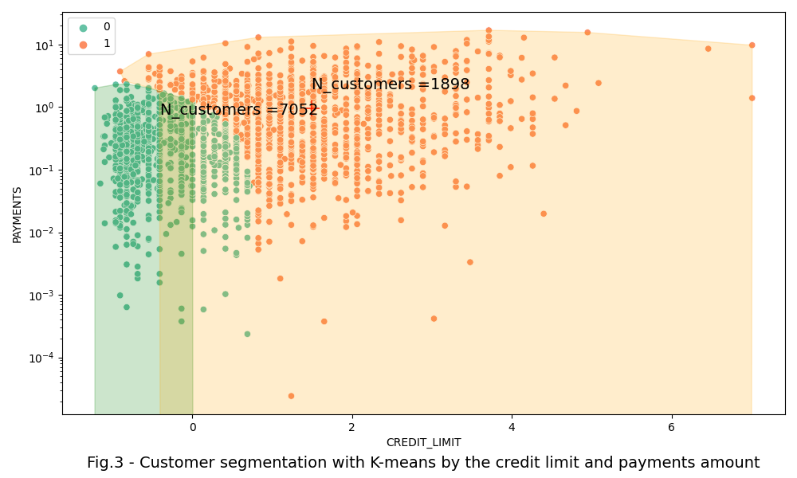
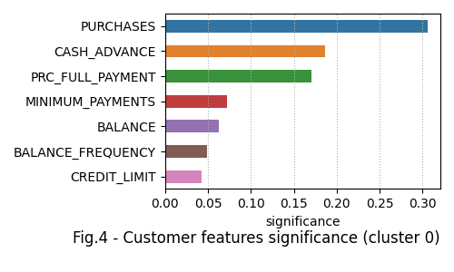

# customer_segmentation


## Content

* [Summary](README.md#Summary)  
* [Project description](README.md#Project-description)  
* [Data and methods](README.md#Data-and-methods)
* [Results](README.md#Results) 
* [Project structure](README.md#Project-structure)        

---

## Summary
Credit card users were segmented using several unsupervised learning algorythms such as: k-means, DBSCAN, and AgglomerativeClustering. Optimal number of clusters was founded using two methods: elbow and silhouette.

## Project description
This project is focused on clustering of credict card holders with several unsupervised clustering algorithms. Customer segmentation helps to study customer behavior and allows to target customers with customized marketing strategies. 

## Data and methods
The dataset contains information about 8950 card holders. Since each of them has 18 features, it is impossible to represent them on a plain without a transformation. It could be, for instance, a reduction of the features number. On the other hand, it is worth to start clusterizating with all features.

The optimal number of clusters was identified using several techniques such as: enertia estimation (fig.1 A), and elbow methods (fig.1 B). The silhouette method indicates that it would be better to spread customers by 3 distinct clusters that is easy to use and understand. In contrast to the silhouette method, clustering by the distortion score and inertia do not clearly shows the optimal number of clusters.

<center>  </center>

## Results
Two features: credit limit and Payments were chosen to represent clustering results. On the fig.3 it can be seen 3 clusters of customers whcih were colored as follows:
* 0 (green color, on the left bottom corner) - 6209 customers with low credit limit, and payments from low to moderate.
* 1 (orange color, on the right bottom corner) - 2556 customers with moderate and high credit limits and payments
- 2 (blue color on the right top corner) - 185 customers with large amount of payments

<center>  </center>

Customers within the largest 0th segment can be characterized by following features (by descenidg of the feature significance):
- large purchases and big expenditures
- borrowing cash against the card's line of credit
- they rarely repaid borrowed sum on their credit balance
- their 'MINIMUM_PAYMENTS' amounts are quite large of $ 677 \pm 19347$ of a currency. In case the credit card minimum payments due value is calculated as 5% from the total outstanding amount, borrowers owe some succifient amounts of money to the bank
- most of users has a positive card balance of $ 936 \pm 19347$, and notably, the balance is updated regularly

In result, the 0th segment represent the most active customers in terms of revenue generation for the bank.

<center>  </center> 


## Project structure

<details>
  <summary>display project structure </summary>

```Python

```
</details>